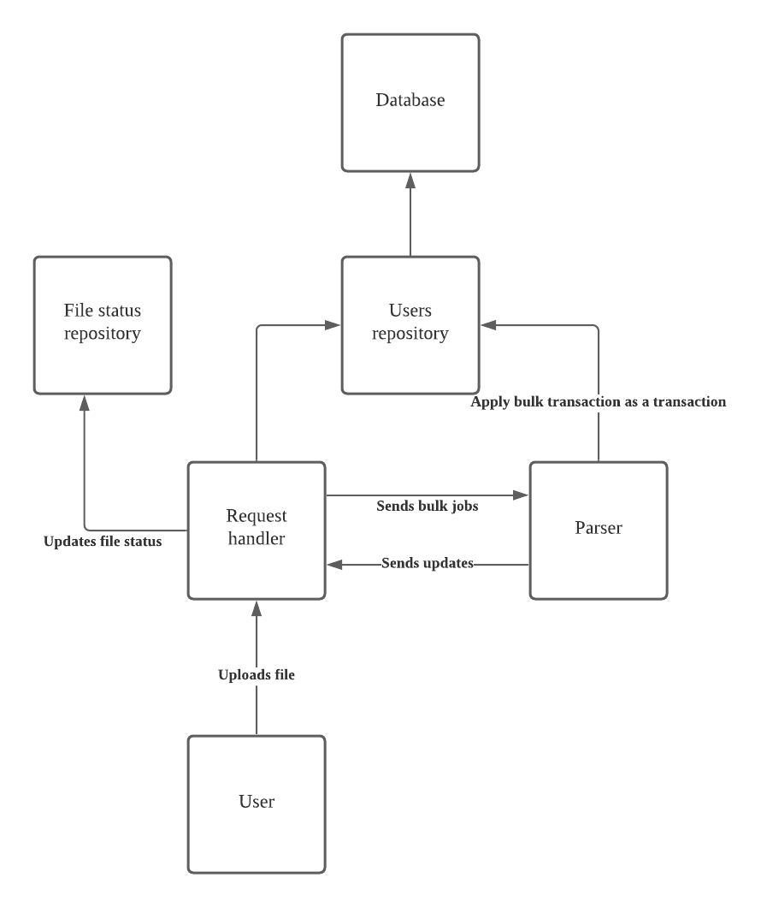

# Employee Salary Management System

Proof of concept implementation of the salary management system, the three main tech used is as follow:

| Layer    | Tech                          |
| -------- | ----------------------------- |
| frontend | React via Create React App    |
| backend  | Golang with Gin web framework |
| backend  | Postgres                      |

## Running the source code

Code is currently only available to run in development mode.

### Environment file

Create an environment file, for this example we can just run this command in the root:

    mv .env.example .env.dev

### Start docker

In the root directory:

    docker compose up

### Default endpoints

|          | Endpoint                |
| -------- | ----------------------- |
| frontend | https://localhost:3000/ |
| backend  | https://locahost:5000/  |

### Running golang unit tests

Get container Ids

    docker ps --format 'CONTAINER ID : {{.ID}} | Name: {{.Names}} | Image:  {{.Image}} |  Ports: {{.Ports}}'

returns something like this:

    CONTAINER ID : 355ea15f561d | Name: employee-salary-management_react_1 | Image:  employee-salary-management_react |  Ports: 0.0.0.0:3000->3000/tcp
    CONTAINER ID : b82ca0524729 | Name: employee-salary-management_golang_1 | Image:  employee-salary-management_golang |  Ports: 0.0.0.0:5000->5000/tcp
    CONTAINER ID : 3ca4cd5a5d18 | Name: employee-salary-management_postgres_1 | Image:  postgres |  Ports: 5432/tcp

look for container id with name like: `employee-salary-management_golang_1`

then run:

    docker exec -it b82ca0524729 go test -v ./...

### Notes

It takes a while for the dependencies of the react-app to be installed.

## Design

Below i will briefly describe the main components of this architecture.

### Request handler

The controller, receives the http request, marshals any query, post or form data, then dedicate the work to the internal services.

Here we construct the http response that is to be sent back to the user, it is here we ensure that responses follow a consistent format, error or not.

### User repository

Primary role of this module is to govern how data flows in and out of the users store through a defined interface; data validations as well as main business logics with regard to users will reside here.

### Parser

Implemented as something like a job queue, with a consumer that constantly consumes and process the CSV files one at a time, then applying the changes via the user repo.

Parser runs on a separate thread.

How it work is as follows:

1.  Request handler receives upload, saves it to a temporary location
2.  handler will create a job request, specifying the path to the file, and send it to the parser.
3.  as soon as the parser is free of any job at hand, it will pick up the job, read in the file, then process it.

Through out the different stages of queued, processing, completed and error, parser will inform via a channel for the handler to update the status of the file via the File status repo.

### File status repository

This is currently a non persistent in memory solution, but can be potentially stored in a database like Redis. The data stored here is expected to have a high frequency of queries right after the user uploads the file, and does not need to be long lived.
